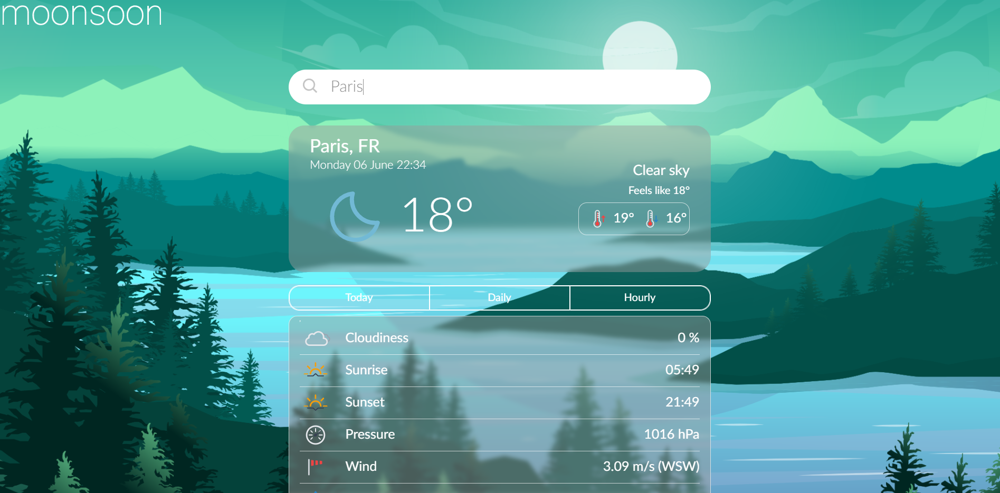

# :shopping_cart: Progressive Web App - Weather App :cloud:

🔗https://moonsoon-weather-app.netlify.app/home

Weather app with a nice-looking UI displaying current weather at the given city. Project created in a Progressive Web Application design. Redux Toolkit with Thunks used. 

## :wrench: Tech-stack
* React (React Hooks, React Router) :atom_symbol:
* Redux Toolkit + Thunks :trident:
* Styled-components + SCSS :nail_care:
*

## :clipboard: Main features :rocket:
* app is created in PWA (Progressive Web App) design, it can be added to home screen of mobiles phones (iOS/Android) or on desktop (Linux/Windows)
* responsive for all possible resolutions
* creating reusable React  components with React hooks and Redux :arrows_counterclockwise:
* thoughtful project architecture to improve maintainability, refactoring and understanding of the written code :thinking:
* Styling with a styled-components - creating reusable styles, themes applied to the components
* (in progress) Payments provided by the Stripe.

## ⏲️Things to be done
* Add weather map based on the location of user ❔
* Air quality information ❔
* Modification of UI - slide-in menu ❔
* Possibility of saving some favourites locations ❔

# Examples of usage on different devices

## Android

   

## Desktop - Windows

  

# Getting Started with Create React App

This project was bootstrapped with [Create React App](https://github.com/facebook/create-react-app).

## Available Scripts

In the project directory, you can run:

### `npm start`

Runs the app in the development mode.\
Open [http://localhost:3000](http://localhost:3000) to view it in the browser.

The page will reload if you make edits.\
You will also see any lint errors in the console.

### `npm test`

Launches the test runner in the interactive watch mode.\
See the section about [running tests](https://facebook.github.io/create-react-app/docs/running-tests) for more information.

### `npm run build`

Builds the app for production to the `build` folder.\
It correctly bundles React in production mode and optimizes the build for the best performance.

The build is minified and the filenames include the hashes.\
Your app is ready to be deployed!

See the section about [deployment](https://facebook.github.io/create-react-app/docs/deployment) for more information.

### `npm run eject`

**Note: this is a one-way operation. Once you `eject`, you can’t go back!**

If you aren’t satisfied with the build tool and configuration choices, you can `eject` at any time. This command will remove the single build dependency from your project.

Instead, it will copy all the configuration files and the transitive dependencies (webpack, Babel, ESLint, etc) right into your project so you have full control over them. All of the commands except `eject` will still work, but they will point to the copied scripts so you can tweak them. At this point you’re on your own.

You don’t have to ever use `eject`. The curated feature set is suitable for small and middle deployments, and you shouldn’t feel obligated to use this feature. However we understand that this tool wouldn’t be useful if you couldn’t customize it when you are ready for it.

## Learn More

You can learn more in the [Create React App documentation](https://facebook.github.io/create-react-app/docs/getting-started).

To learn React, check out the [React documentation](https://reactjs.org/).
